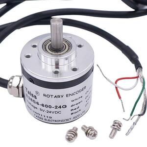

# Volume knob

Use a Waveshare RP2040-Zero to turn a quadrature encoder into a
volume knob for your computer. Works great with something like
<https://a.co/d/04KHyvDu>:



## Requirements

### Hardware

You will need a [Waveshare RP2040-Zero]. This is very similar to a [Raspberry Pi Pico] and the code will probably work with a Pico with only minimal changes (e.g., changing the `PICO_BOARD` setting in `CMakeLists.txt`).

[raspberry pi pico]: https://www.waveshare.com/wiki/RP2040-Zero
[waveshare RP2040-Zero]: https://www.waveshare.com/wiki/RP2040-Zero

### Software

If you intend to build the firmware from source, you will need:

- [pico-sdk]
- [picotool]

[pico-sdk]: https://github.com/raspberrypi/pico-sdk
[picotool]: https://github.com/raspberrypi/picotool

## Configuration

In [config.h](config.h), you may want to set:

- `ENCODER_PIN_A`, `ENCODER_PIN_B`

  Defines the GPIOs to which the encoder outputs are attached.

- `DEFAULT_KEY_CW`, `DEFAULT_KEY_CCW`

  Defines which key events are sent on clockwise and counter-clockwise rotation. Defaults to volume up/volume down.

- `DEFAULT_ENCODER_DIVIDER`

  Defines how many events we need to receive from the encoder before generating a key event.

### Runtime Configuration

You may also configure these values at runtime using the `vkcfg` tool (located in the [tools/](tools/) subdirectory). To view the current configuration:

```sh
$ vkcfg get
key_cw   = volume_increment
key_ccw  = volume_decrement
divider  = 256
```

To configure the knob to send up arrow/down arrow instead of volume up/volume down:

```sh
$ vkcfg set --cw arrow_up --ccw arrow_down
OK
$ vkcfg get
key_cw   = arrow_up
key_ccw  = arrow_down
divider  = 256
```

To save the configuration to flash so that it will persist after a device reboot:

```sh
$ vkcfg save
```

## Building

This is a [pico-sdk]-based project. You will need a copy of the [pico-sdk], and you will need to set the `PICO_SDK_PATH` environment variable to point to the location of the sdk directory.

To build from source:

```sh
cmake -B build
make -C build
```

## Installing the firmware

After building from source:

1. `vkcfg bootsel`

    This will reboot the Pico into bootsel mode.

1. `picotool load build/volume_knob.uf2 -x`

    This will write the code to the device and reboot it.

## License

volume-knob -- Use a quadrature encoder as a volume knob\
Copyright (C) 2026 Lars Kellogg-Stedman

This program is free software: you can redistribute it and/or modify
it under the terms of the GNU General Public License as published by
the Free Software Foundation, either version 3 of the License, or
(at your option) any later version.

This program is distributed in the hope that it will be useful,
but WITHOUT ANY WARRANTY; without even the implied warranty of
MERCHANTABILITY or FITNESS FOR A PARTICULAR PURPOSE.  See the
GNU General Public License for more details.

You should have received a copy of the GNU General Public License
along with this program.  If not, see <https://www.gnu.org/licenses/>.
